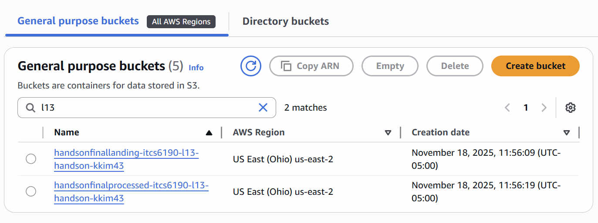
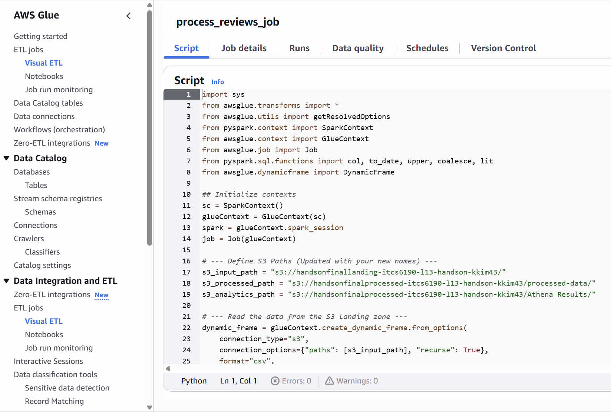
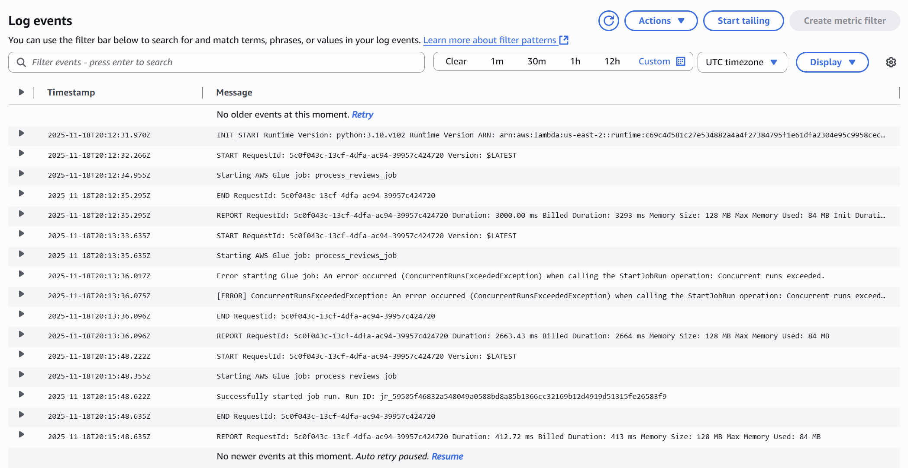
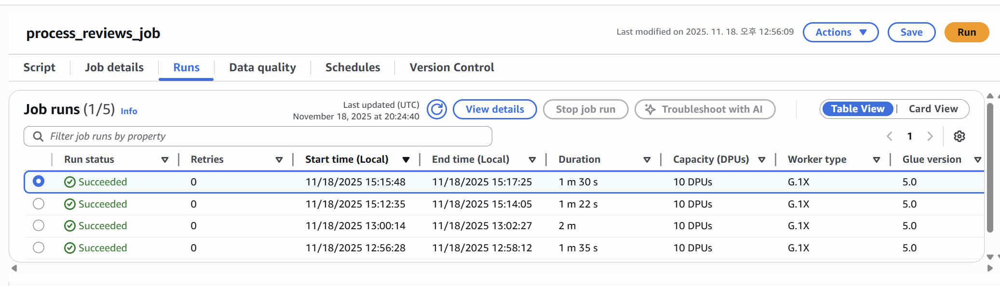
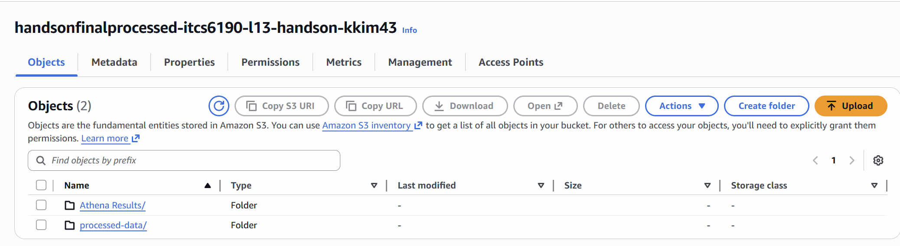
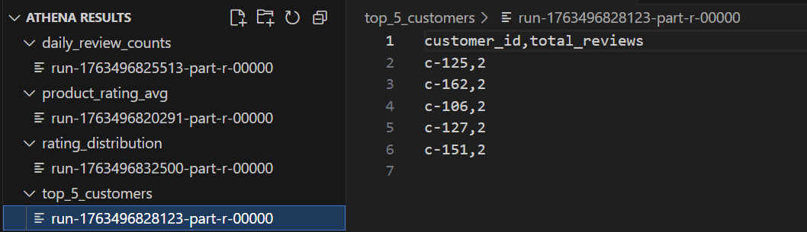

# 2025 ITCS6190 Hands-on L13  

**Name (ID):** Kiyoung Kim (801426261)  
**Email:** kkim43@charlotte.edu  

This project implements a **fully automated, event-driven, serverless ETL pipeline** using:  
- AWS S3  
- AWS Lambda  
- AWS Glue (Spark + PySpark)  

When a new CSV review file is uploaded to S3, Lambda automatically triggers a Glue ETL job that cleans the data, runs analytics with Spark SQL, and writes the results back into another S3 bucket — **all without manual action.**

---

# Project Goal

This assignment simulates a real cloud data engineering workflow:

1. Upload product review CSV → S3 landing bucket  
2. Lambda detects file creation event  
3. Lambda starts AWS Glue Spark ETL job  
4. Glue ETL job:  
   - Reads & cleans CSV  
   - Runs **4 Spark SQL queries** (3 additional queries required in instructions)  
   - Saves final results into a processed S3 bucket  

This builds a **no-touch automated pipeline** used in modern data engineering systems.

---

# Project Repository Structure

```
2025_ITCS6190_Hands-on_L13/
│
├── README.md
│
├── src/
│   ├── glue_etl_script.py
│   └── lambda_function.py
│
├── input/
│   └── reviews.csv
│
├── output/
│   ├── processed-data/
│   │   └── run-1763497006162-part-r-00000
│   │
│   └── Athena Results/
│       ├── product_rating_avg/
│       │   └── run-1763496820291-part-r-00000
│       ├── daily_review_counts/
│       │   └── run-1763496825513-part-r-00000
│       ├── top_5_customers/
│       │   └── run-1763496828123-part-r-00000
│       └── rating_distribution/
│           └── run-1763496832500-part-r-00000
│
└── screenshots/
```

---

# Architecture Diagram

```
S3 (Upload)
     ↓
AWS Lambda (Trigger)
     ↓
AWS Glue ETL (Spark Job)
     ↓
S3 (Processed Results)
```

This design is **fully serverless**, automatically scalable, and event-driven.

---

# ⚙️ Technologies Used

- **Amazon S3** – raw + processed data storage  
- **AWS Lambda** – event-driven trigger  
- **AWS Glue (Spark)** – ETL + analytics  
- **PySpark & Spark SQL** – data transformations  
- **AWS IAM** – access & execution control  

---

# Step-by-Step Deployment

## **1️⃣ Create S3 Buckets**
Two globally unique buckets:

- Landing bucket  
  `handsonfinallanding-itcs6190-l13-handson-kkim43`
- Processed bucket  
  `handsonfinalprocessed-itcs6190-l13-handson-kkim43`

**Screenshot:**  


---

## **2️⃣ Upload `reviews.csv` to Landing Bucket**

Uploading this file triggers the entire pipeline.


---

## **3️⃣ Create IAM Role for Glue**

Role name: `AWSGlueServiceRole-Reviews`  
Attached policies:

- AWSGlueServiceRole  
- AmazonS3FullAccess (for this assignment)

---

## **4️⃣ Create the AWS Glue ETL Job**

- Job Name: **process_reviews_job**
- Script Source: `src/glue_etl_script.py`



---

## **5️⃣ Create AWS Lambda Trigger Function**

Name: **start_glue_job_trigger**  
Runtime: Python 3.10  
Purpose: Start Glue job on S3 upload

### Add Inline Policy:

```json
{
  "Version": "2012-10-17",
  "Statement": [
    {
      "Effect": "Allow",
      "Action": "glue:StartJobRun",
      "Resource": "*"
    }
  ]
}
```


---

## **6️⃣ Lambda CloudWatch Logs**

Shows job trigger confirmation.



---

# Glue ETL Processing Details

## Data Cleaning Steps

- Convert `rating` → integer  
- Fill missing values  
- Convert `review_date` → date  
- Uppercase product_id  
- Default "No review text" for empty text  

---

# Spark SQL Analytics (4 Queries)

Below are the four Spark SQL queries executed in the Glue ETL job.

---

### **1. Average Rating per Product**
```sql
SELECT 
    product_id_upper, 
    AVG(rating) AS average_rating,
    COUNT(*) AS review_count
FROM product_reviews
GROUP BY product_id_upper
ORDER BY average_rating DESC
```

Output: `output/Athena Results/product_rating_avg/`

---

### **2. Daily Review Count**
```sql
SELECT 
    review_date,
    COUNT(*) AS review_count
FROM product_reviews
GROUP BY review_date
ORDER BY review_date
```

Output: `output/Athena Results/daily_review_counts/`

---

### **3. Top 5 Most Active Customers**
```sql
SELECT 
    customer_id,
    COUNT(*) AS total_reviews
FROM product_reviews
GROUP BY customer_id
ORDER BY total_reviews DESC
LIMIT 5
```

Output: `output/Athena Results/top_5_customers/`

---

### **4. Rating Distribution**
```sql
SELECT 
    rating,
    COUNT(*) AS rating_count
FROM product_reviews
GROUP BY rating
ORDER BY rating
```

Output: `output/Athena Results/rating_distribution/`

---

# Glue Job Monitoring

Job completed successfully.



---

# Output Files (Final Results)

## Processed Dataset
```
output/processed-data/
```

## Analytics Outputs (All 4 Queries)



---

# Sample Output File



---

# Cleanup Instructions

To avoid AWS charges:

- Delete S3 buckets  
- Delete Glue ETL job  
- Delete Lambda function  
- Delete IAM role  

---
